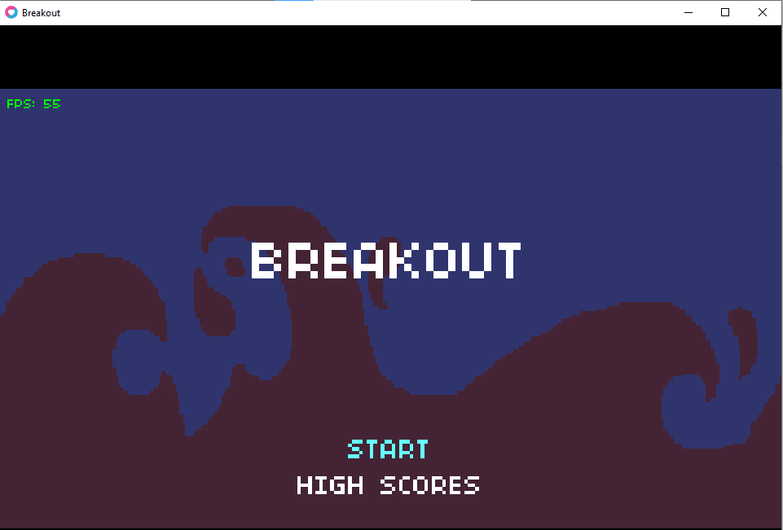
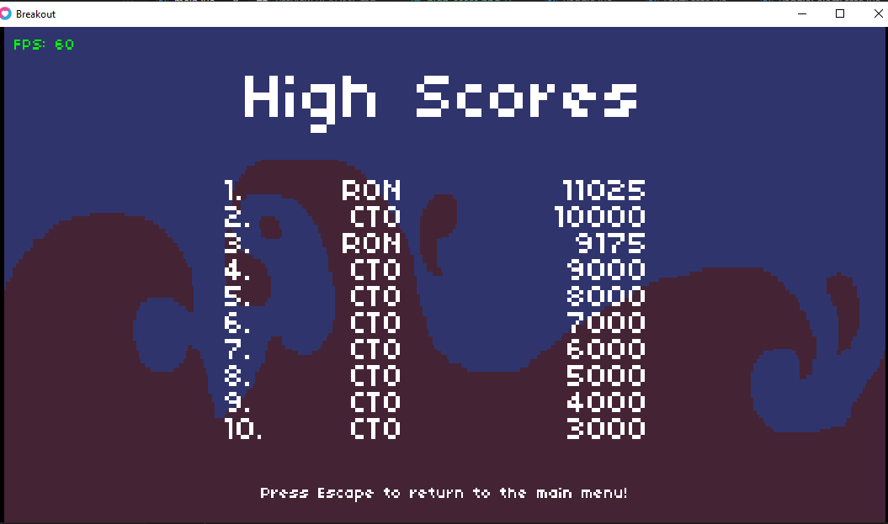
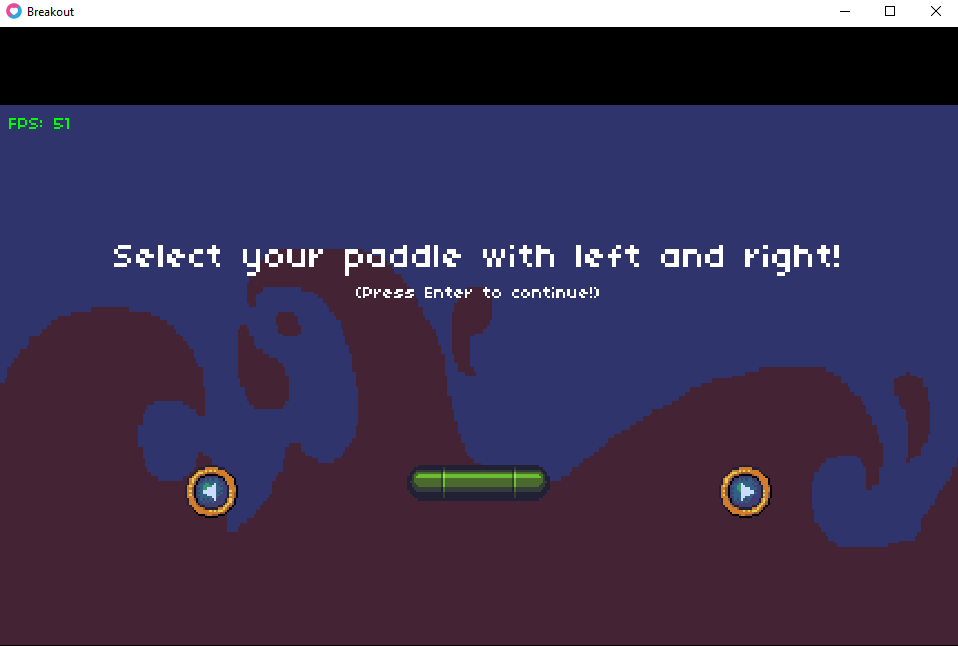
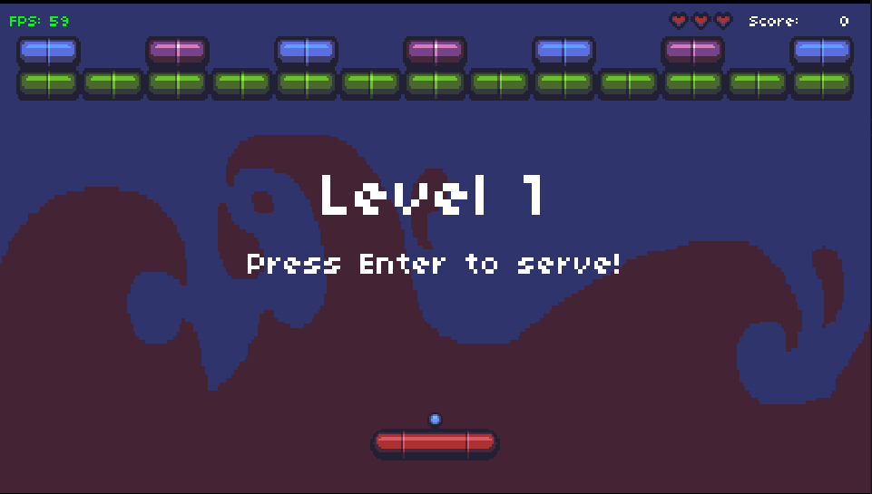
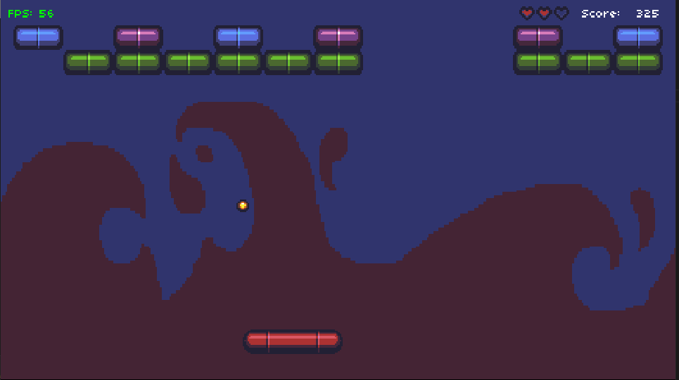

# Breakout
A remake of the [Atari](https://en.wikipedia.org/wiki/Atari,_Inc.) BreakOut game  
<i>[Breakout](https://en.wikipedia.org/wiki/Breakout_(video_game)) is an arcade video game developed and published by Atari, Inc. and released on May 13, 1976. It was designed by Steve Wozniak, based on conceptualization from Nolan Bushnell and Steve Bristow who were influenced by the seminal 1972 Atari arcade game Pong </i>

# GamePlay

## start
Launch the game in LÖVE2D

## High Scores
You can view previous high scores, by selecting Down Key and Pressing Enter

## Select Paddle
Select your paddle

## Begin
Begin play

## Play
Play the game
